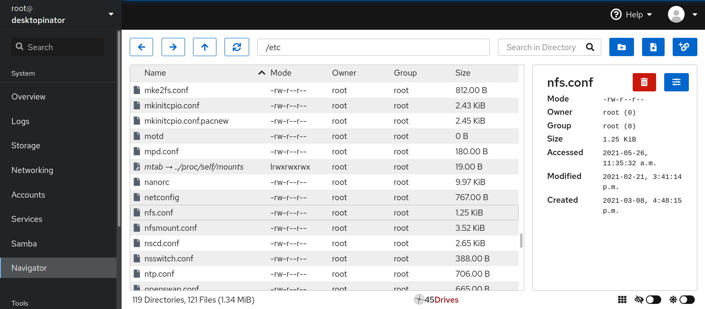

# Cockpit Navigator
A Featureful File System Browser for Cockpit - remotely browse, manage, edit, upload, and download files on your server through your web browser.  

## Features
With no command line use needed, you can:
* Navigate the entire filesystem,
* Create, delete, and rename files,
* Edit file contents,
* Edit file ownership and permissions,
* Create symbolic links to files and directories,
* Reorganize files through cut, copy, and paste,
* **Upload files by dragging and dropping**,
* **Download files and directories**.

| Browsing Filesystem |
|---------------------|
|  |

| Editing Content | Editing Properties | 
|-----------------|--------------------|
|  |  |

# Installation
## From Github Release
### Ubuntu
1. `$ wget https://github.com/45Drives/cockpit-navigator/releases/download/v0.5.10/cockpit-navigator_0.5.10-1focal_all.deb`
1. `# dpkg -i cockpit-navigator_0.5.10-1focal_all.deb`
### EL7
1. `# yum install https://github.com/45Drives/cockpit-navigator/releases/download/v0.5.10/cockpit-navigator-0.5.10-1.el7.noarch.rpm`
### EL8
1. `# dnf install https://github.com/45Drives/cockpit-navigator/releases/download/v0.5.10/cockpit-navigator-0.5.10-1.el8.noarch.rpm`
## From Source
1. Ensure dependencies are installed: `cockpit`, `python3`, `rsync`, `zip`.
1. `$ git clone https://github.com/45Drives/cockpit-navigator.git`
1. `$ cd cockpit-navigator`
1. `$ git checkout <version>` (v0.5.10 is latest)
1. `# make install`
## From 45Drives Repositories
### Automatic Repo Setup with Script
```sh
curl -sSL https://repo.45drives.com/setup -o setup-repo.sh
sudo bash setup-repo.sh
```
#### Ubuntu
```sh
sudo apt install cockpit-navigator
```
#### El7/EL8
```sh
sudo dnf install cockpit-navigator
```
### Manually
#### Ubuntu
1. Import GPG Key
```sh
wget -qO - https://repo.45drives.com/key/gpg.asc | sudo gpg --dearmor -o /usr/share/keyrings/45drives-archive-keyring.gpg
```
2. Add 45drives.sources
```sh
cd /etc/apt/sources.list.d
sudo curl -sSL https://repo.45drives.com/lists/45drives.sources -o /etc/apt/sources.list.d/45drives.sources
sudo apt update
```
3. Install Package
```sh
sudo apt install cockpit-navigator
```
#### EL7
1. Add 45drives.repo
```sh
sudo curl -sSL https://repo.45drives.com/lists/45drives.repo -o /etc/yum.repos.d/45drives.repo
sudo sed -i 's/el8/el7/g;s/EL8/EL7/g' /etc/yum.repos.d/45drives.repo
sudo yum clean all
```
2. Install Package
```bash
sudo yum install cockpit-navigator
```
#### EL8
1. Add 45drives.repo
```sh
sudo curl -sSL https://repo.45drives.com/lists/45drives.repo -o /etc/yum.repos.d/45drives.repo
sudo dnf clean all
```
2. Install Package
```bash
sudo dnf install cockpit-navigator
```
